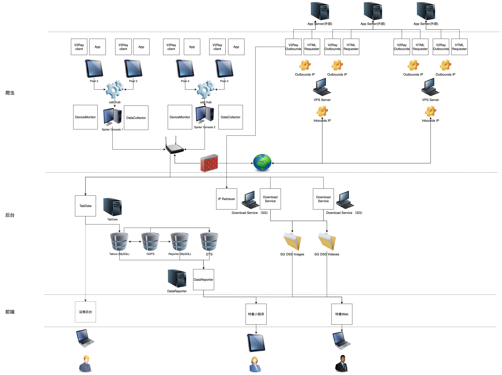

# tabcut工作笔记

需求（https://udu133ckhp.feishu.cn/wiki/wikcnvGQIsr8nMJj69UPI90eg9f）

四部分关键数据（商店 商品 达人 视频）

=====================================================================
## day1
- 参考项目（https://github.com/CreditTone/hooker）
- collector 项目 
  - 环境：
    - anconda&pycharm
    - java 1.8
    - android studio (sdk 安装最新的即可)
    - ~/.zshrc环境配置
```text
/Library/Java/JavaVirtualMachines/jdk1.8.0_331.jdk/Contents/Home/bin:/Users/albert/Library/Android/sdk/platform-tools:/Users/albert/Library/Android/sdk/build-tools/32.0.0
export PATH=$PATH:/Users/albert/Library/Android/sdk/platform-tools:/Users/albert/Library/Android/sdk/build-tools/32.0.0
MAVEN_HOME=/Users/albert/bin/apache-maven-3.2.5/bin
export PATH=$MAVEN_HOME:$PATH

export JAVA_HOME=/Library/Java/JavaVirtualMachines/jdk1.8.0_331.jdk/Contents/Home
export JAVA_HOME
export PATH=$JAVA_HOME/bin:$PATH
export CLASSPATH=.:$JAVA_HOME/lib/dt.jar:$JAVA_HOME/lib/tools.jar
export ANDROID_HOME=/Users/albert/Library/Android/sdk
alias work='cd ~/Project/Collector/DataCollector'
```
  - debug: ./hooking debug.js 根据debug.js文件中的to_save_response 在控制台写入调用指令
  - 项目通过运行Aplication.py 并加入参数使用 spider-single-pixel2.json shop_job_rpc.js debug（是否手动操作页面）

  - 爬虫技术方案(https://udu133ckhp.feishu.cn/docs/doccnyGEjvNGDnEDHDuy0RMU8Dh)
## day2

- 用户的BIO数据爬取 
  - 数据库
    - host：
    - username：
    - password：